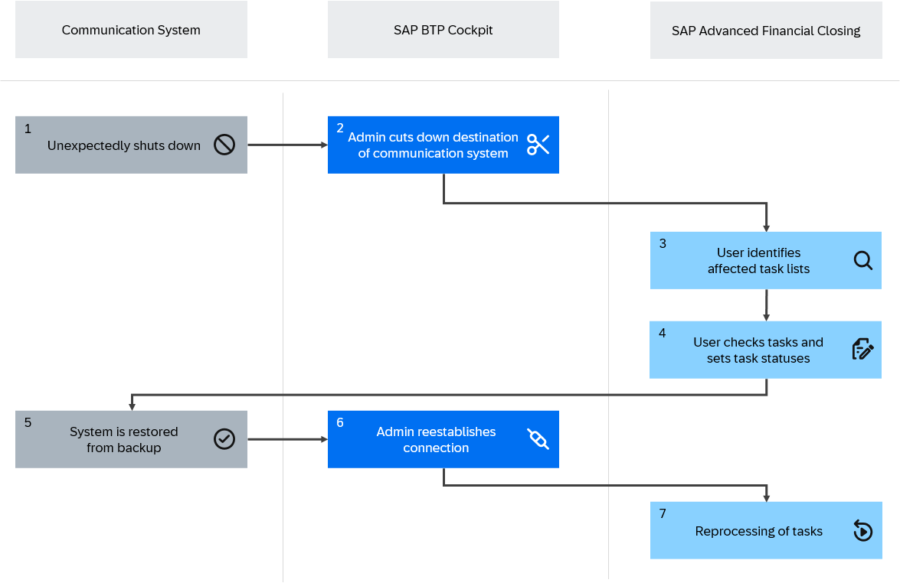

<!-- loioa320988958e2405cb37c2f1dec79bc6b -->

# Communication System Unavailable - Restore Required

Understand how to handle SAP Advanced Financial Closing if a communication system is unavailable and requires a restore from a backup.

<a name="loioa320988958e2405cb37c2f1dec79bc6b__section_z2k_xmr_3hc"/>

## Context

Since SAP Advanced Financial Closing processes data from connected communication systems, system performance is not only influenced by maintenance windows and downtimes of SAP Advanced Financial Closing, but also by maintenance windows and downtimes of the connected communication systems. In the event of a connected communication system going down unexpectedly, it is crucial to restore the system from a backup, possibly to a point in time up to 30 minutes before the failure. This ensures minimal data loss and continuity of operations. The restoration process described below involves several steps to manage tasks and connections effectively, preventing unintended processing and ensuring system integrity.

Before reestablishing the system connection, you need to consider the following aspects:

-   **System downtime impact**: When the communication system goes down, tasks in SAP Advanced Financial Closing and other processes relying on the connection to the communication system may be disrupted.
-   **Task management**: Tasks in progress or completed shortly before the downtime need careful handling to avoid data inconsistencies.
-   **Connection management**: The connection to the communication system must be managed carefully to prevent accidental task resumption during the restoration process.

The following graphic gives an overview of system behavior:

<a name="loioa320988958e2405cb37c2f1dec79bc6b__section_exg_43t_qxb"/>

## Navigation to Apps in Connected Systems

From the *Process Closing Tasks* app, you can in general navigate to apps in connected communication systems to process tasks. However, if the corresponding communication system is unavailable, this navigation doesn't work. In this case, you receive the default system message issued by the affected communication system.

<a name="loioa320988958e2405cb37c2f1dec79bc6b__section_ikw_1jt_qxb"/>

## Job Processing

Tasks of type *Job* may already have been started when the communication system becomes unavailable. In this case, the jobs fail.

### Scheduling

SAP Advanced Financial Closing can schedule jobs to run in connected communication systems. However, if the corresponding communication system is unavailable, the system can no longer schedule new tasks. The affected tasks remain in the scheduling queue and are processed once the connected system is available again. Manual scheduling, however, isn't possible if the connected system isn't available: Consequently, jobs for manual scheduling need to be scheduled again in SAP Advanced Financial Closing when the communication system is available again.

<a name="loioa320988958e2405cb37c2f1dec79bc6b__section_rnq_xkt_qxb"/>

## Synchronization

SAP Advanced Financial Closing runs regular synchronizations with the connected communication systems. However, if a communication system is unavailable, these synchronizations don't work. The system will try to run them again after a certain time. For more information about the handling of synchronization runs, see [Synchronization of Communication Systems](synchronization-of-communication-systems-a86348d.md) and [Monitor Communication Systems](../System-Monitoring/monitor-communication-systems-a215069.md).

<a name="task_fz2_zmr_3hc"/>

<!-- task\_fz2\_zmr\_3hc -->

## How to Reestablish the Connection to a Disconnected Communication System

Reestablish the connection to a communication system and manage affected tasks during the restoration.

<a name="task_fz2_zmr_3hc__prereq_t15_1xr_3hc"/>

## Prerequisites

-   Users performing the steps in the SAP BTP cockpit are authorized to do so.
-   Users managing the task statuses and reprocessing in SAP Advanced Financial Closing are authorized to change statuses and reprocess tasks:
    -   Your user must have a role collection assigned that includes the role template `AFC_Process`.

        For more information about role templates, see [How to Manage Static Role Templates](../User-Management/how-to-manage-static-role-templates-0cca34d.md) and [Static Roles for SAP Advanced Financial Closing](../User-Management/static-roles-for-sap-advanced-financial-closing-b92a241.md).

    -   You must be authorized to perform the following steps through one of the following options:

        -   Authorizations granted through user role assignment:

            Your user must have a user role assigned for the *Task Processing* scope with *Process* authorization.

        -   Authorization granted through direct user assignment: For more information, see [Direct User Assignment](../User-Management/direct-user-assignment-f96b217.md).

The following graphic provides an overview of the steps required to reestablish the connection without data inconsistencies:

## Procedure

**Preparation Prior to Restoration**

1.  Before initiating system restoration, access the SAP BTP cockpit and close down the destination to the affected communication system. You do this by invalidating the credentials \(for example, by entering an incorrect user or password\).

    This prevents any accidental resumption of activities during the restoration process.

**Identify Affected Objects**

2.  In SAP Advanced Financial Closing, identify all active task lists that target the affected communication system. This will help in determining which tasks need attention post-restoration.

3.  Once you've determined the restoration point in time, compare the *Completed* timestamps of any tasks potentially affected in SAP Advanced Financial Closing with the restoration point:

    1.  Tasks completed before the restoration point can be left as is.

    2.  For tasks that started after the restoration point or that were in progress during the downtime, set their status to *Failed* manually. This prevents unintended processing and ensures task chains do not continue erroneously.

**Resume Connection and Reprocess Tasks**

4.  After the restoration is complete and all tasks have been managed as described above, resume the connection to the communication system in the SAP BTP cockpit.

5.  Once the connection is reestablished, review and reprocess tasks that were set to *Failed* or *Completed with Errors*. This ensures all necessary tasks are completed correctly and system operations return to normal.

<a name="task_fz2_zmr_3hc__result_cwy_yhs_3hc"/>

## Results

You have now restored your communication system and reestablished the connection to SAP Advanced Financial Closing.

