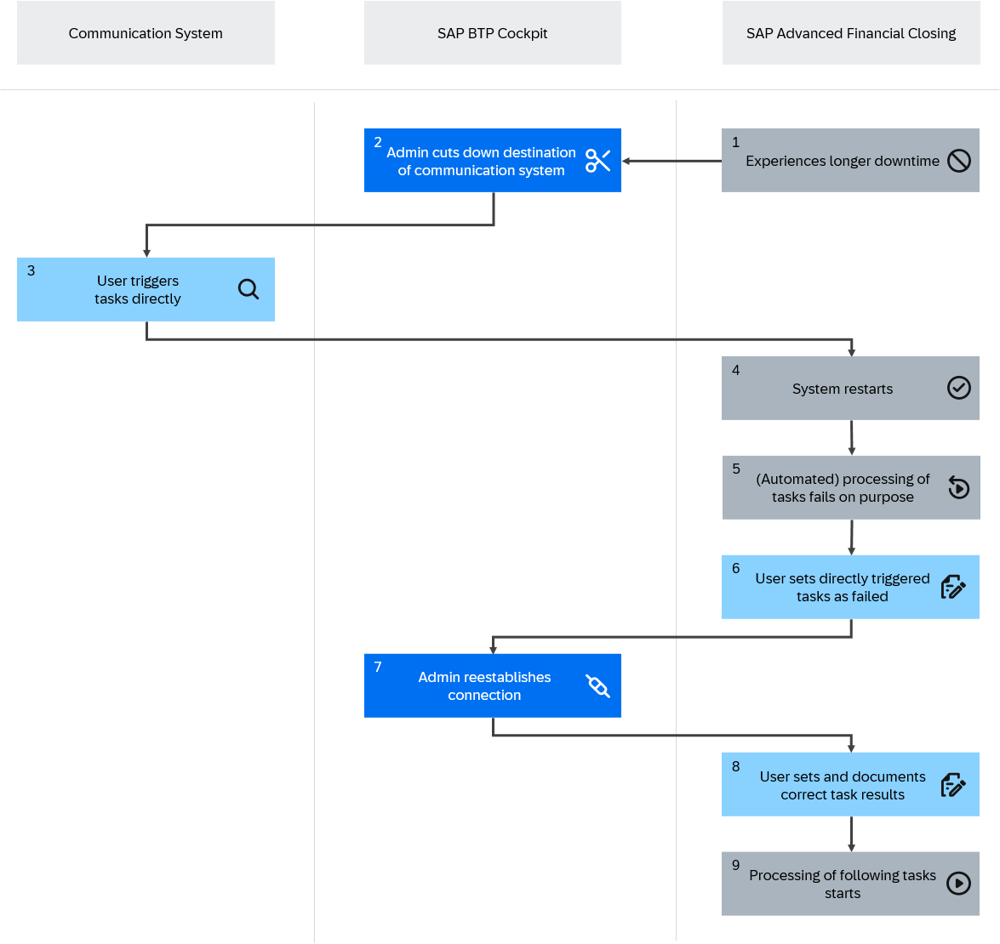

<!-- loioa6e3fffb86404a288247505966f92ffe -->

# SAP Advanced Financial Closing Unavailable Unexpectedly

Understand how to handle SAP Advanced Financial Closing if it becomes unavailable and runs into an unexpectedly long downtime.

<a name="loioa6e3fffb86404a288247505966f92ffe__section_z2k_xmr_3hc"/>

## Context

Since SAP Advanced Financial Closing processes data from connected communication systems, a downtime of SAP Advanced Financial Closing may influence the processing of tasks in the communication system.

In the event of SAP Advanced Financial Closing going down **unexpectedly and longer than expected**, you may want to trigger tasks manually directly in the corresponding communication system to keep your financial close on time. However, if you trigger tasks directly in the communication system, we recommend manually cutting off the connection between the communication system and SAP Advanced Financial Closing. In this case, you need to pay attention to some aspects in SAP Advanced Financial Closing **prior to and after triggering tasks manually directly in the communication system**. The process described below involves several steps to manage tasks and connections effectively to prevent data inconsistencies.

> ### Caution:  
> Only trigger tasks manually directly in the communication system if SAP Advanced Financial Closing has an **unplanned and unexpectedly long** downtime. For more information about the system status, check the cloud service status for SAP Advanced Financial Closing under [SAP Trust Center](https://help.sap.com/docs/link-disclaimer?site=https%3A%2F%2Fwww.sap.com%2Fabout%2Ftrust-center%2Fcloud-service-status.html).

When triggering tasks directly in the communication system during a downtime of SAP Advanced Financial Closing, you need to consider the following aspects:

-   **System downtime impact**: When SAP Advanced Financial Closing goes down, tasks can no longer be triggered from SAP Advanced Financial Closing, but they may be triggered directly in the communication system.
-   **Task management**: Tasks may be triggered directly in the communication system, but you need to pay attention to task statuses in SAP Advanced Financial Closing.
-   **Connection management**: The intentional interruption of the connection to the communication system and the reestablishment of that connection must be managed carefully to prevent data inconsistencies.

The following graphic gives an overview of system behavior:

<a name="loioa6e3fffb86404a288247505966f92ffe__section_exg_43t_qxb"/>

## Navigation to Apps in Connected Systems

From the *Process Closing Tasks* app, you can in general navigate to apps in connected communication systems to process tasks. However, if SAP Advanced Financial Closing is unavailable, this option obviously cannot be used because you can't access the *Process Closing Tasks* app. You may still access the corresponding apps directly from within the connected communication systems to continue your work.

<a name="loioa6e3fffb86404a288247505966f92ffe__section_ikw_1jt_qxb"/>

## Job Processing

If SAP Advanced Financial Closing becomes unavailable, tasks of type *Job* can no longer be scheduled from within SAP Advanced Financial Closing. Tasks may, however, be triggered manually directly in the communication system.

<a name="loioa6e3fffb86404a288247505966f92ffe__section_rnq_xkt_qxb"/>

## Synchronization

SAP Advanced Financial Closing runs regular synchronizations with the connected communication systems. However, if SAP Advanced Financial Closing is unavailable, these synchronizations can't work. The system will try to run them again after a certain time. For more information about the handling of synchronization runs, see [Synchronization of Communication Systems](synchronization-of-communication-systems-a86348d.md) and [Monitor Communication Systems](../System-Monitoring/monitor-communication-systems-a215069.md).

<a name="task_i5z_pdt_3hc"/>

<!-- task\_i5z\_pdt\_3hc -->

## How to Ensure Consistent Task Status Handling in the Event of Unplanned Long Downtimes of SAP Advanced Financial Closing

Reestablish the connection to SAP Advanced Financial Closing and manage affected tasks before reestablishing the connection.

<a name="task_i5z_pdt_3hc__prereq_ycv_j2t_3hc"/>

## Prerequisites

-   Users performing the steps in the SAP BTP cockpit are authorized to do so.
-   Users managing the task statuses in SAP Advanced Financial Closing are authorized to change statuses and reprocess tasks:
    -   Your user must have a role collection assigned that includes the role template `AFC_Process`.

        For more information about role templates, see [How to Manage Static Role Templates](../User-Management/how-to-manage-static-role-templates-0cca34d.md) and [Static Roles for SAP Advanced Financial Closing](../User-Management/static-roles-for-sap-advanced-financial-closing-b92a241.md).

    -   You must be authorized to perform the following steps through one of the following options:

        -   Authorizations granted through user role assignment:

            Your user must have a user role assigned for the *Task Processing* scope with *Process* authorization.

        -   Authorization granted through direct user assignment: For more information, see [Direct User Assignment](../User-Management/direct-user-assignment-f96b217.md).

## Context

The following graphic provides an overview of the steps required to reestablish the connection without data inconsistencies:

## Procedure

**Preparation for Manual Triggering Directly in the Communication System**

> ### Caution:  
> Only trigger tasks manually directly in the communication system if SAP Advanced Financial Closing has an **unplanned and unexpectedly long** downtime.

1.  Prior to triggering any tasks manually in the connected communication systems, access the SAP BTP cockpit and close down the destination to the affected communication systems. You do this by invalidating the credentials \(for example, by entering an incorrect user or password\).

    This prevents SAP Advanced Financial Closing from accidentally retriggering tasks that you intend to trigger manually in the connected system.

2.  You can now safely trigger tasks manually in the connected communication system.

**Managing Status Handling of Affected Tasks**

3.  After SAP Advanced Financial Closing restarts, it will try to trigger jobs. However, since the connection has been cut off, all affected jobs will fail on purpose.

4.  In SAP Advanced Financial Closing, you now look for all the jobs you triggered directly in the communication system and check that their status is set to *Failed* or *Completed with Errors*. If this is not the case, set the status manually to *Completed with Errors*.

5.  After all tasks have been managed as described in the previous steps, resume the destination to the communication system in the SAP BTP cockpit.

6.  In SAP Advanced Financial Closing, manually set the statuses of the tasks you triggered directly in the communication system. Choose one of the following procedures for that:

    1.  Set latest task as successful first:

        1.  In the affected task chains, find the last task that you triggered directly in the communication system and set it to a successful status \(that is, *Completed Without Errors*, *Completed with Warnings*, or *Checked*\).

            This allows the following tasks to be processed.

        2.  Now, manually update the statuses and document the results of the tasks earlier in the task chain.

            > ### Recommendation:  
            > Also check tasks that SAP Advanced Financial Closing triggered before going down. Ensure that SAP Advanced Financial Closing has received the correct task status from the communication system.

    2.  Set earliest task as successful first:

        1.  In the affected task chains, find the earliest task that you triggered directly in the communication system and set it to a successful status \(that is, *Completed Without Errors*, *Completed with Warnings*, or *Checked*\).
        2.  Now, continue with the following tasks, and update the statuses and document the results. Once you finish the last task, the following tasks can be processed as well.

            > ### Recommendation:  
            > Also check tasks that SAP Advanced Financial Closing triggered before going down. Ensure that SAP Advanced Financial Closing has received the correct task status from the communication system.

