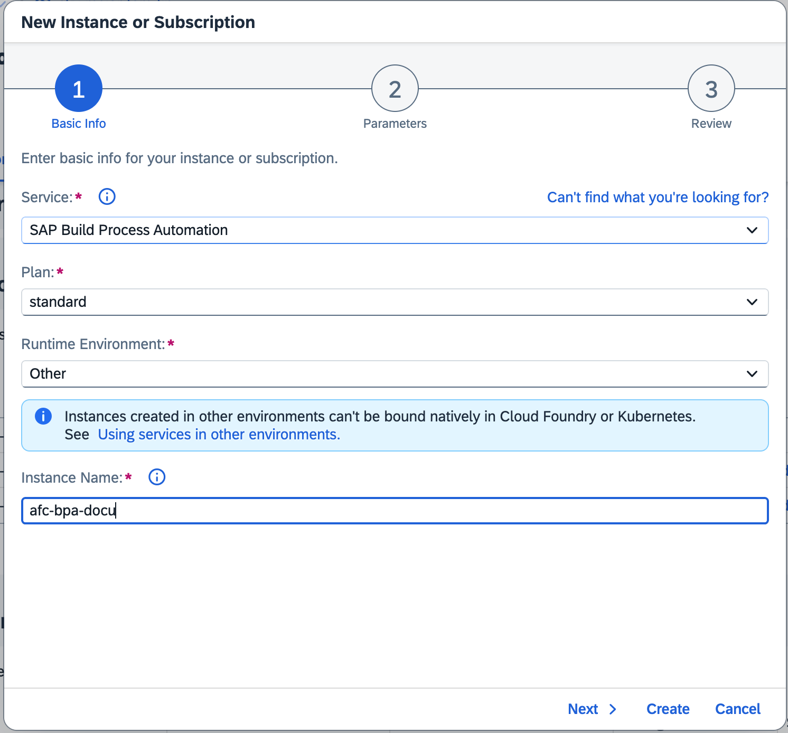
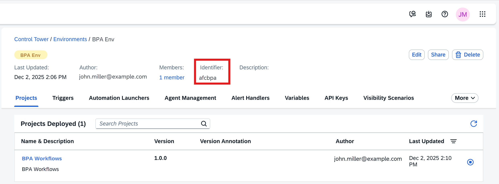
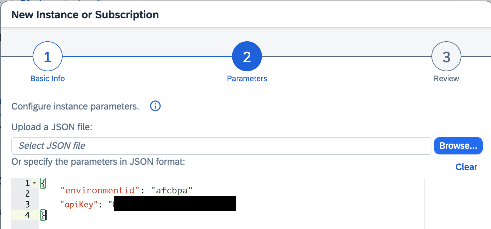
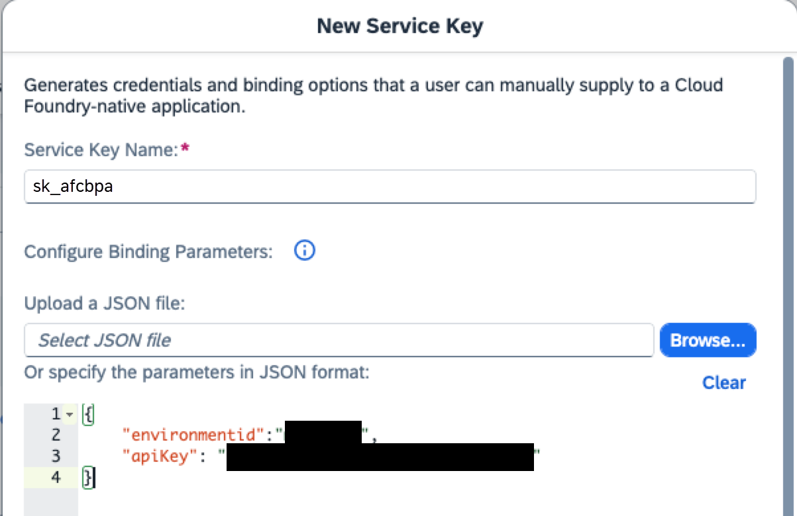

<!-- loio0d8e37f0589e4ef7a9fbbc48de4c1ea4 -->

# How to Set Up the SAP Build Process Automation Integration for SAP Advanced Financial Closing

Set up an integration with SAP Build Process Automation to use SAP Advanced Financial Closing to trigger workflows.

<a name="loio0d8e37f0589e4ef7a9fbbc48de4c1ea4__prereq_nqx_p4r_zcc"/>

## Prerequisites

-   For the steps to be performed with regards to or in SAP Build Process Automation, you need to have the required authorization.
-   For the steps to be performed in SAP Advanced Financial Closing, the following authorizations are required:
    -   Your user must have a role collection assigned that includes one of the following role templates:

        -   `AFC_SystemAdmin`

        -   `AFC_SpecifySystemsApp`

        For more information about role templates, see [How to Manage Static Role Templates](../User-Management/how-to-manage-static-role-templates-0cca34d.md) and [Static Roles for SAP Advanced Financial Closing](../User-Management/static-roles-for-sap-advanced-financial-closing-b92a241.md).

## Context

In SAP Build Process Automation, you can create workflows to perform specific steps, providing conditions and events and a lot more. You can set up an integration between SAP Build Process Automation and SAP Advanced Financial Closing to use SAP Advanced Financial Closing to trigger these workflows. After processing, the status of the workflow is then reported back to SAP Advanced Financial Closing. This way, you can fully integrate workflows into your financial close and use SAP Advanced Financial Closing to trigger them automatically and receive results, and apply an approval process.

## Procedure

1.  If not done yet, subscribe to SAP Build Process Automation as described under [Subscribe to SAP Build Process Automation](https://help.sap.com/docs/build-process-automation/sap-build-process-automation/subscribe-to-sap-build-process-automation) \(SAP Build Process Automation documentation\).

2.  In the subaccount in which you have **your subscription for SAP Build Process Automation**, perform the following steps as described in the SAP Build Process Automation documentation:

    1.  Create a **shared** environment. For more information, see [Create an Environment](https://help.sap.com/docs/build-process-automation/sap-build-process-automation/create-environment?version=LATEST).

        > ### Remember:  
        > An environment is a functional area in which you deploy and run your SAP Build Process Automation projects. For more information about environments, see [Environments](https://help.sap.com/docs/build-process-automation/sap-build-process-automation/environments?version=LATEST).

    2.  Create an apiKey for the environment you've just created. For more information, see [Add API Keys to an Environment](https://help.sap.com/docs/build-process-automation/sap-build-process-automation/add-api-keys?version=LATEST).

        When deciding on the scopes during the apiKey creation, select any appropriate scope you might potentially need.

    3.  Create a service instance for SAP Build Process Automation, providing the apiKey you've just created. For more information, see [Create a Service Instance](https://help.sap.com/docs/build-process-automation/sap-build-process-automation/create-service-instance).

        > ### Caution:  
        > Use the values as described here.

        1.  Under *Basic Info*, provide the following information:

            <table>
            <tr>
            <th valign="top">

            Field
            
            </th>
            <th valign="top">

            Value
            
            </th>
            </tr>
            <tr>
            <td valign="top">
            
            *Service*
            
            </td>
            <td valign="top">
            
            `SAP Build Process Automation`
            
            </td>
            </tr>
            <tr>
            <td valign="top">
            
            *Plan*
            
            </td>
            <td valign="top">
            
            `standard`
            
            </td>
            </tr>
            <tr>
            <td valign="top">
            
            *Runtime Environment*
            
            </td>
            <td valign="top">
            
            `Other`
            
            </td>
            </tr>
            <tr>
            <td valign="top">
            
            *Instance Name*
            
            </td>
            <td valign="top">
            
            Enter a name for this service instance.
            
            </td>
            </tr>
            </table>
            
            Here is an example of what this would look like:

            

        2.  Under *Parameters*, provide the following information:

            -   Provide the **apiKey** you've created in the previous step.
            -   Provide the **environment ID**.

                > ### Tip:  
                > You can find the identifier of the environment under *Control Tower* \> *Environments*. Go to the corresponding environment and check the information under *Identifier* in the header. Note that the environment identifier should be entered in lowercase.

                Here you can see where to find the identifier information:

                

            Here is an example of what this would look like:

            

    4.  Create a service key based on the service instance you've just created. For more information, see [Create a Service Key for the SAP Build Process Automation Instance](https://help.sap.com/docs/build-process-automation/sap-build-process-automation/create-service-key-for-sap-build-process-automation-instance).

        > ### Caution:  
        > Use the values as described here.

        To configure the parameters, provide the following information:

        -   Provide the **environment ID**.

            > ### Tip:  
            > You can find the identifier of the environment under *Control Tower* \> *Environments*. Go to the corresponding environment and check the information under *Identifier* in the header. Note that the environment identifier should be entered in lowercase.

        -   Provide the **apiKey** you've created in the previous step.

        Here is an example of what this would look like:

        

3.  In the subaccount in which you have **your subscription for SAP Advanced Financial Closing**, create a destination for SAP Build Process Automation based on the service key you've just created. For more information, see [Configure SAP Build Process Automation Destinations](https://help.sap.com/docs/build-process-automation/sap-build-process-automation/configure-sap-build-process-automation-destinations) \(SAP Build Process Automation documentation\).

**Setting up a communication system in SAP Advanced Financial Closing**

4.  Set up a communication system for SAP Build Process Automation as described under [SAP Build Process Automation](../Connectivity/sap-build-process-automation-7385663.md) in the *Connectivity* section of this guide.

**Creating workflows in SAP Build Process Automation**

5.  If not done yet, create workflows in SAP Build Process Automation that you want to include into your financial close managed in SAP Advanced Financial Closing. For information on how to do this, see [How to Create Workflows in SAP Build Process Automation and Integrate Them into the Financial Close](https://help.sap.com/viewer/b3f5b9cf1ab7498fad5b6f297013d65a/SHIP/en-US/24599e4d0fab4d0d9633d0024e89cb4f.html "Set up workflows in SAP Build Process Automation that can then be triggered by SAP Advanced Financial Closing.") :arrow_upper_right:.

    > ### Tip:  
    > The authorizations required for steps in SAP Build Process Automation are described under [Authorizations](https://help.sap.com/docs/build-process-automation/sap-build-process-automation/authorizations) \(SAP Build Process Automation documentation\).

    > ### Caution:  
    > SAP Advanced Financial Closing currently doesn't support arrays or relative dates for parameters of workflows in SAP Build Process Automation.

<a name="loio0d8e37f0589e4ef7a9fbbc48de4c1ea4__result_r2l_qxr_zcc"/>

## Results

You have now finished the preparation to use an integration between SAP Advanced Financial Closing and SAP Build Process Automation.

