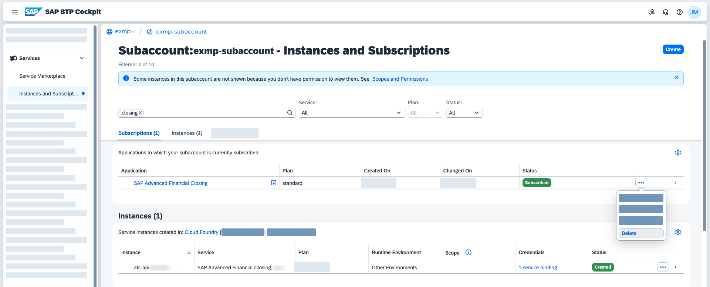

<!-- loioe2312ef61bf84937bac994f4747a89cd -->

<link rel="stylesheet" type="text/css" href="../css/sap-icons.css"/>

# Offboarding

Request the deletion of your SAP Advanced Financial Closing tenant.

## Context

If you want to delete your SAP Advanced Financial Closing tenant and your data, you need to create an incident to request the deletion. However, be aware that as a precaution against accidental deletion, the deletion process is blocked for a grace period of 60 days after you have requested the deletion.

The deletion of your tenant and your data in SAP Advanced Financial Closing covers the deletion of **all** of the following:

-   Task list templates and task lists

-   Tasks, including ongoing processes and related approvals

-   Attachments that aren't maintained in the connected communication systems

-   Configuration and business logging data

> ### Caution:  
> Once the process to unsubscribe is initiated, a resubscription is no longer possible.

If you wish to delete your tenant and your data, perform the following steps:

## Procedure

1.  In the SAP BTP cockpit, go to the relevant global account and subaccount.

2.  Go to *Services* \> *Instances and Subscriptions*.

3.  In the *Subscriptions* section, search for `SAP Advanced Financial Closing`.

4.  In the corresponding table row, choose  \(Actions icon\) and then *Delete*.

    > ### Caution:  
    > After you have chosen *Delete*, a resubscription is no longer possible.

    

5.  **Optional:** If you have an SAP Advanced Financial Closing API, perform the same steps in the *Instances* section as follows:

    1.  In the *Instances* section, search again for `SAP Advanced Financial Closing`.

    2.  In the corresponding table row, choose  \(Actions icon\) and then *Delete*.

        > ### Caution:  
        > After you have chosen *Delete*, a resubscription is no longer possible.

<a name="loioe2312ef61bf84937bac994f4747a89cd__result_pss_tyz_mpb"/>

## Results

Once the deletion process is completed, your tenant has been offboarded and all your data in SAP Advanced Financial Closing has been deleted. A resubscription to the same tenant is no longer possible. You can, however, subscribe to a new tenant provided that your contract is valid.

