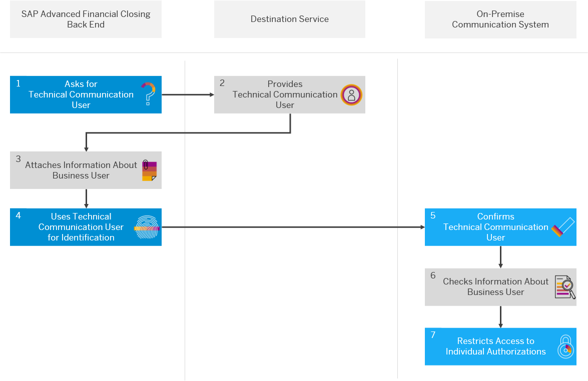

<!-- loioc3103486249048fc8b75fe731fa60dc9 -->

# Authorization Handling During System Communication

Authorization handling during communication with an on-premise system.

## Context

During communication between the SAP Advanced Financial Closing back end and the connected SAP S/4HANA or SAP ERP communication system, the following two types of user come into play:

-   **Business user**:

    The business user identifies the individual end user.

-   **Technical communication user**:

    The technical communication user is used by the SAP Advanced Financial Closing back end to access the communication system.

<a name="loioc3103486249048fc8b75fe731fa60dc9__section_yvs_dwy_bfc"/>

## Authorization Process

To enable communication with the connected communication system, the following process comes into play:

> ### Note:  
> The list points correspond to the numbered steps shown in the graphic below.

1.  SAP Advanced Financial Closing back end **contacts the destination service** to ask for the technical communication user information.
2.  The destination service **provides the information of the technical communication user** to SAP Advanced Financial Closing.
3.  SAP Advanced Financial Closing now **attaches information about the business user**.

    This is required because the technical communication user potentially has more authorizations in the communication system than the individual user has. Accordingly, the communication system requires the business user information and the corresponding authorizations so as to **restrict access accordingly**.

4.  The SAP Advanced Financial Closing back end uses the technical communication user information - with the business user information attached - to **obtain authentication** from the communication system.
5.  The communication system **confirms** that the technical communication user is valid.
6.  The communication system **checks the business user information**.
7.  The communication system **restricts access** to the individual authorizations.

The following graphic depicts this connection:

