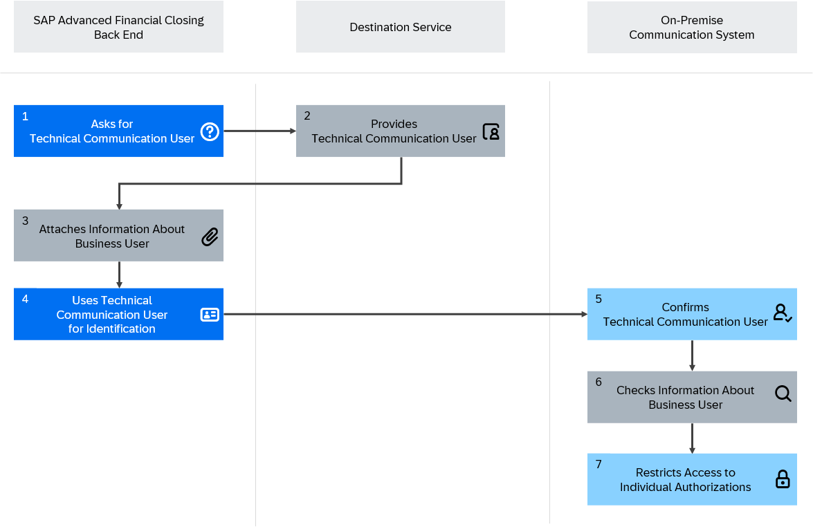

<!-- loioc3103486249048fc8b75fe731fa60dc9 -->

# Authorization Handling During System Communication

Authorization handling during communication with an on-premise system.

During communication between the SAP Advanced Financial Closing back end and the connected SAP S/4HANA or SAP ERP communication system, two types of user come into play: the business user and the technical communication user. The business user identifies the individual end user, while the technical communication user is used by the SAP Advanced Financial Closing back end to access the communication system.

An individual user is authenticated by the SAP Advanced Financial Closing back end using a business user to which authorizations are attached. To enable communication with the connected communication system, the SAP Advanced Financial Closing back end first requires the technical communication user data, which gives access to the communication system. This information is provided by the destination service. However, since the technical communication user potentially has more authorizations in the communication system than the individual user has, the communication system in turn requires the business user information and the corresponding authorizations so as to restrict access accordingly. Therefore, the SAP Advanced Financial Closing back end attaches the business user information when it uses the technical communication user information to obtain authentication from the communication system. The communication system confirms that the technical communication user is valid, and then checks the business user information to restrict access.

The following graphic depicts this connection:

