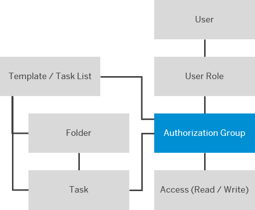
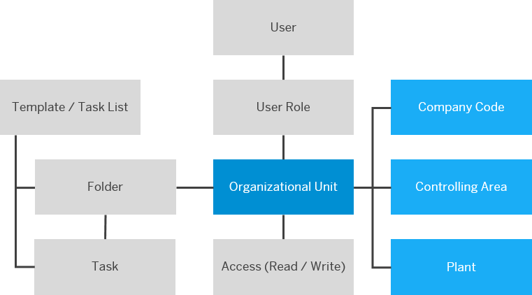

<!-- loio6fa5e4e9c35f4032850307b1864d9f73 -->

# User Access Management

You can control and grant access to task list templates, task lists, and tasks in SAP S/4HANA Cloud for advanced financial closing. By default, users don't have access to these objects.

Users who have been assigned a static role can see the respective apps in the SAP Fiori launchpad \(see [How to Manage Static Role Templates](How_to_Manage_Static_Role_Templates_0cca34d.md)\). For the following apps, you need to grant access to users so that they're able to view or edit **task list templates**, **task lists**, **tasks**, and **folders**:

-   *Define Closing Tasks*

    The right to create task list templates is given automatically to every user that has the role template `AFC_Define` assigned.

-   *Process Closing Tasks*

    Read access to the *Process Closing Tasks* app is given automatically to every user that has the role template `AFC_Process` assigned.

-   *Approve Closing Tasks*

-   *Financial Close Overview*

-   *Closing Task Completion*

-   *Change Log*

In all other apps, users with a matching static role always have full access so that no further access needs to be granted on object level.

**Types of Access**

You can grant either read access or write access. If you grant write access, read access is automatically granted as well. The access you grant applies in the apps to which the respective users have access via their static role.

To get an overview of what is considered a read action or a write action and to find the possible means of granting read or write access, see [Overview of Actions and Means to Grant Access](Overview_of_Actions_and_Means_to_Grant_Access_6f05d23.md).

**Means of Granting Access**

You grant access to users in one of the following ways:

-   By assigning a user to a properly configured user role

-   By assigning a user to an object as a responsible or processing user or as part of a responsible or processing user group

-   By defining a user as a substitute of another user

**Combining Access Restrictions**

You can assign several user roles to one user. By assigning additional user roles, you always **extend** the users' access so that they have access to all instances and organizational units specified in the respective user roles.

> ### Note:  
> You can also assign user roles with conflicting access restrictions to one user. In this case, the less restrictive user role overrules others.

<a name="loio6fa5e4e9c35f4032850307b1864d9f73__section_j1v_njb_ckb"/>

## General Access

You can grant general read-only access or write access to users. This access applies to **all** of the following objects in the respective apps:

-   Task list templates

-   Task lists

-   Tasks

-   Folders

Find out how to maintain general access restrictions under [How to Grant Access in General](How_to_Grant_Access_in_General_b96fb86.md).

<a name="loio6fa5e4e9c35f4032850307b1864d9f73__section_y4f_jln_lkb"/>

## System-Wide Access

You can grant general read-only or write access to users for a specific connected communication system. This access applies to all of the following in the respective apps for the objects **of the specified communication system**:

-   Task lists

-   Tasks

-   Folders

Find out how to maintain system-wide access restrictions under [How to Grant System-Wide Access](How_to_Grant_System-Wide_Access_2105a6f.md).

<a name="loio6fa5e4e9c35f4032850307b1864d9f73__section_sjm_z4s_bkb"/>

## Access According to Specific Objects

In the respective apps, you can grant access to **specific**

-   Task list templates

-   Task lists

-   Tasks

The access applies to objects in all organizational units.

When you grant access on instance level, you grant read or write access to specific objects indirectly via **authorization groups**. The authorization group is the connection between a user role and the specific objects. The access you grant for an authorization group applies to all objects to which the authorization group is assigned. This abstraction level between user roles and specific objects enables you to grant access to collections of objects, for example, according to the domain of expertise.

The following graphic shows the connection between user roles and the specific objects via authorization groups.

**What's the benefit of granting access on the level of instances?**

-   You structure the work so that people can focus on the tasks for which they are responsible.
-   You ensure that users get access only to those objects that they need to perform their tasks.

Find out how to grant access according to specific objects under [How to Grant Access According to Specific Objects](How_to_Grant_Access_According_to_Specific_Objects_0f2fcd8.md).

<a name="loio6fa5e4e9c35f4032850307b1864d9f73__section_f34_wkt_bkb"/>

## Access According to Organizational Units

When your task lists are set up according to the organizational hierarchy, the folders represent your organizational units.

You can then grant access to **tasks** that belong to **specific folders** representing the following in the respective apps:

-   Company codes

-   Controlling areas

-   Plants

The organizational units depend on the data in the connected financial communication systems. To be able to grant access according to organizational units, the task list hierarchy must be set up according to the organizational hierarchy so that the folders represent company codes, controlling areas, and/or plants.

The following graphic shows the connection between user roles and organizational units.

Find out how to grant access according to organizational units under [How to Grant Access According to Organizational Units](How_to_Grant_Access_According_to_Organizational_Units_e6fa5d2.md).

<a name="loio6fa5e4e9c35f4032850307b1864d9f73__section_n3x_334_jkb"/>

## Default Access for Directly Assigned Users and User Groups

Users who are maintained as owners of a task list template or task list or who belong to an assigned owner group have write access to the specific object in the *Define Closing Tasks* app.

Users who are maintained as the user responsible for a **folder**, **task list**, or **task**, or who belong to a responsible user group always have write access to the respective object. They don't need to have a user role assigned in addition.

Users who are maintained as the processing user of a **task** or who belong to a processing user group always have access to the respective task. To be able to process the respective task, they don't need to have a user role assigned in addition.

> ### Restriction:  
> A substitute of a user responsible or processing user only inherits access to the objects to which the user responsible or processing user has been assigned individually and not as part of a user group.

> ### Note:  
> A user who has the role template `AFC_Process` assigned always has read access to all task lists in the *Process Closing Tasks* app.

Find out how to manage user groups under [How to Manage User Groups](How_to_Manage_User_Groups_6d5d683.md).

-   **[Overview of Actions and Means to Grant Access](Overview_of_Actions_and_Means_to_Grant_Access_6f05d23.md "All actions to which you can grant access and the available means to do
		so.")**  
All actions to which you can grant access and the available means to do so.
-   **[How to Grant Access in General](How_to_Grant_Access_in_General_b96fb86.md "You want certain users to have either general read access or general write access.")**  
You want certain users to have either general read access or general write access.
-   **[How to Grant System-Wide Access](How_to_Grant_System-Wide_Access_2105a6f.md "For all objects of a connected financial communication system, you want certain users to have no access, general read access, or general
		write access.")**  
For all objects of a connected financial communication system, you want certain users to have no access, general read access, or general write access.
-   **[How to Grant Access According to Specific Objects](How_to_Grant_Access_According_to_Specific_Objects_0f2fcd8.md "You want to grant users access to specific task list templates, tasks lists, and
		tasks.")**  
You want to grant users access to specific task list templates, tasks lists, and tasks.
-   **[How to Grant Access According to Organizational Units](How_to_Grant_Access_According_to_Organizational_Units_e6fa5d2.md "You want to grant users access to objects in specific company codes, controlling areas,
		or plants.")**  
You want to grant users access to objects in specific company codes, controlling areas, or plants.
-   **[How to Assign Users to User Roles](How_to_Assign_Users_to_User_Roles_8729c2d.md "Specify the users to whom the user roles you've created apply.")**  
Specify the users to whom the user roles you've created apply.
-   **[How to Manage User Groups](How_to_Manage_User_Groups_6d5d683.md "A user group represents a group of users who can be assigned to a particular set of
		closing tasks.")**  
A user group represents a group of users who can be assigned to a particular set of closing tasks.

**Parent topicColonSymbol** [User Management](User_Management_ae7fa30.md "")

**Previous topicColonSymbol** [How to Manage Users](How_to_Manage_Users_c338b30.md "Upload new users to SAP S/4HANA Cloud for advanced financial closing and update certain user attributes.")

